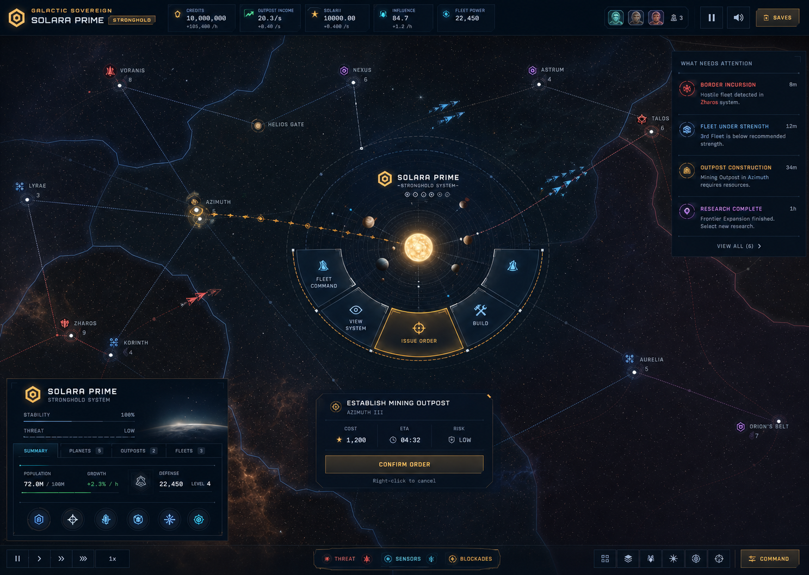
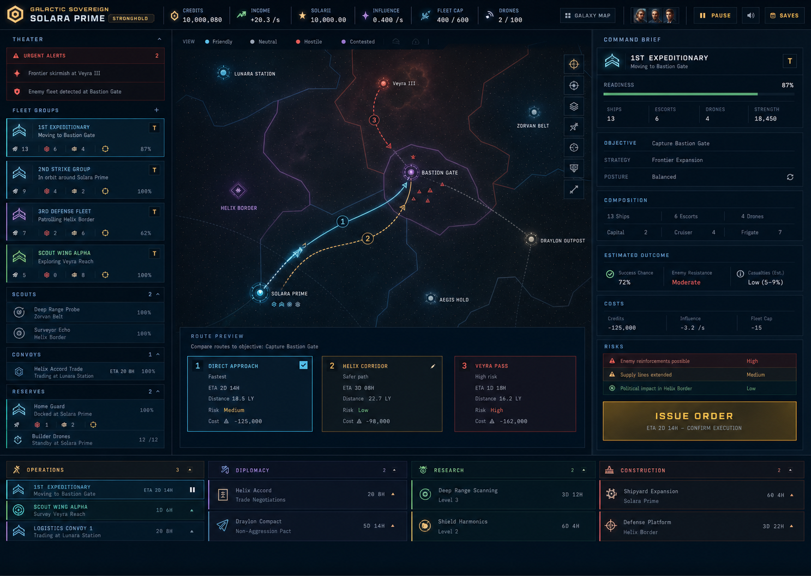
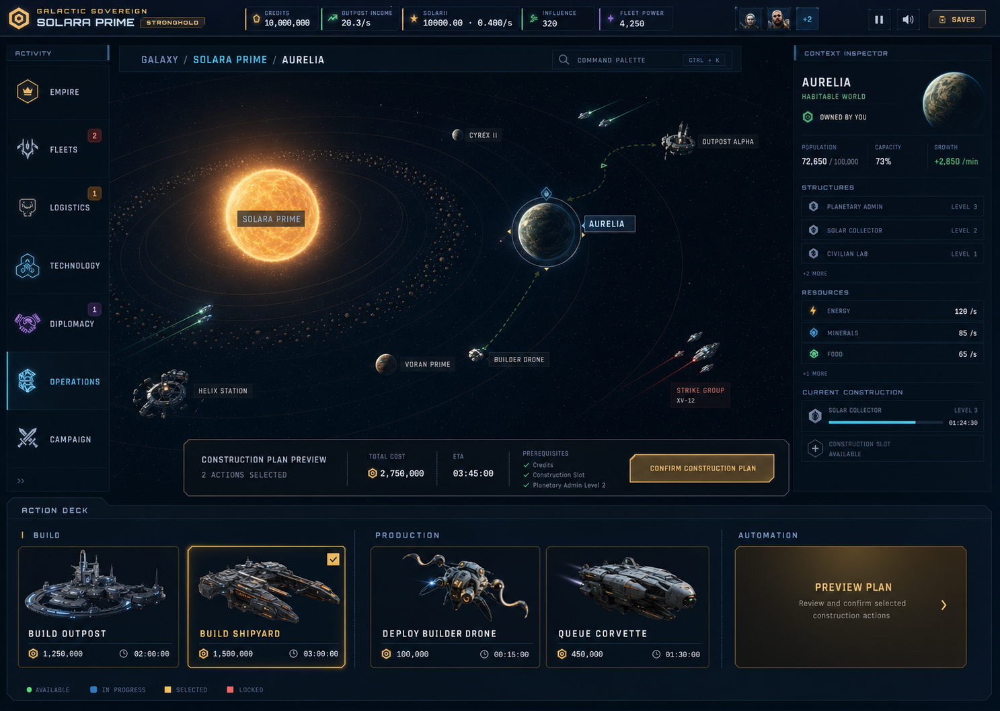

# Galactic Sovereign Command Systems

This package defines three complete player-facing UI directions for Galactic Sovereign. The previews show one focused strategic moment; the accompanying specifications map the rest of the game without cramming every feature into one frame.

**Runtime direction (shipped):** Adaptive Command Deck — live HUD shell in `src/index.html` / `src/js/command-deck.js`. Command Bridge and War Room remain design references only.

Developer, cheat, diagnostic, and administrator controls are intentionally out of scope. Account entry, campaign setup, co-op, saves, audio, tutorials, strategic play, and tactical combat remain in scope.

## Direction 1 — Command Bridge

The galaxy is the primary surface. Selection creates a small contextual command ring, while deep management tools arrive as slide-over workspaces.

- Best for: cinematic exploration, direct map interaction, and low persistent UI density.
- Primary risk: large empires need strong search, filters, and attention routing.
- Specification: [command-bridge.md](command-bridge.md)

## Direction 2 — War Room

Fleets, routes, risks, and persistent operations stay visible around the strategic map. The interface optimizes repeated empire-level decisions.

- Best for: fleet-heavy play, simultaneous operations, and high information throughput.
- Primary risk: density must remain disciplined at smaller desktop resolutions.
- Specification: [war-room.md](war-room.md)

## Direction 3 — Adaptive Command Deck

A stable shell changes its inspector and action deck to match the selected galaxy, system, planet, fleet, convoy, technology, faction, or battle context.

- Best for: learnability, consistency, and scaling the same interaction model across the whole game.
- Primary risk: context changes must be animated and labeled clearly enough to avoid disorientation.
- Specification: [adaptive-command-deck.md](adaptive-command-deck.md)

## Shared Interaction Contract

Every consequential action follows the same sequence:

1. Select a system, body, fleet, convoy, faction, technology, or operation.
2. Inspect availability, ownership, prerequisites, and current state.
3. Preview target, cost, ETA, risk, and downstream effects.
4. Confirm one clearly labeled primary action.
5. Track the order in a persistent ledger; pause, resume, reroute, or cancel where supported.

Destructive actions use rose styling, explicit target names, and a second confirmation. Disabled actions explain why they are unavailable. Co-op actions show the controlling pilot and provide request/release control instead of silently failing.

## Package Contents

- [control-matrix.md](control-matrix.md) is the canonical player-control inventory and placement contract for all three directions.
- [command-bridge.md](command-bridge.md), [war-room.md](war-room.md), and [adaptive-command-deck.md](adaptive-command-deck.md) define each system's hierarchy, surfaces, and responsive behavior.
- [generation-prompts.md](generation-prompts.md) records the exact visual briefs used for the three previews.

## Coverage Audit

Audited against the current UI on 2026-07-22:

- 72 of 72 non-developer static button IDs are mapped.
- 49 of 49 reviewed dynamic control families are mapped.
- All local Markdown links and three preview assets resolve.
- No gameplay code, command payload, save schema, or runtime behavior is changed by this package.
